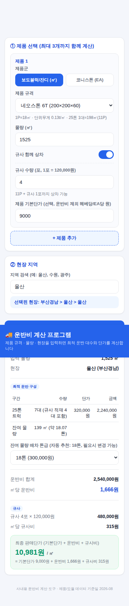

# 운반비 계산 프로그램 (Transport Cost Calculator)

보도블럭 / 잔디 / 코니스톤 등 제품을 현장으로 배송할 때 발생하는 운반비를 자동으로 계산하는 모바일 대응 웹 앱입니다.
제품 규격 · 물량 · 현장 지역을 입력하면 25톤 트럭 기준 최적 운반 대수와 잔여 물량 배차 톤급, 그리고 헤베(㎡)/EA당 운반비를 계산합니다.
제품은 보도블럭/잔디, 코니스톤, 옹벽류(보강토옹벽·식생옹벽·식생호안) 3개 파트로 나뉘어 있습니다. 보도블럭/잔디·코니스톤은 한 번에 최대 3개까지 추가할 수 있고, 2개 이상 넣으면 한 트럭에 섞어 싣는 것까지 고려해 최적화합니다. 옹벽류는 현장 진입로가 좁은 경우가 많아 섞어 싣기 없이 1개 제품씩만 계산합니다.

## 바로 사용하기

별도 설치나 서버 없이 `index.html` 파일 하나로 동작합니다.

- **PC/모바일 모두**: `index.html`을 다운로드해서 브라우저로 열면 바로 사용 가능합니다.
- 인터넷 연결이 없어도 오프라인에서 동작합니다 (모든 데이터가 파일 안에 내장되어 있음).

## 계산 로직

### 제품 1개일 때 (정밀 모드)

1. 입력 물량을 25톤 트럭 적재량(제품별 상이)으로 나누어 **가득 찬 25톤 트럭 대수**를 구합니다.
2. 남는 잔여 물량의 무게(톤)를 계산합니다.
3. 잔여 무게에 가장 가까운 톤급 트럭(1톤 ~ 25톤)을 자동으로 추천합니다. (필요 시 화면에서 직접 변경 가능)
4. 지역별 요율표에서 각 톤급의 운반비를 조회해 합산합니다.
5. 규사(포당 120,000원)를 함께 상차하는 경우, 제품별로 정해진 "규사 적재 시 최대 적재 파렛트 수"만큼 해당 트럭의 적재량을 줄여서 계산합니다 (예: 네오스톤 8T는 정상 11P → 규사 적재 시 10P, 최대 규사 2포). 이 축소분 때문에 트럭이 더 필요해질 수 있습니다.
6. (선택) 제품 기본단가를 입력하면 운반비까지 합산한 최종 판매단가를 보여줍니다.

### 제품 2~3개일 때 (섞어 싣기 모드)

원본 엑셀에는 서로 다른 제품을 한 트럭에 섞어 실을 때의 적재량 데이터가 없어, **무게(톤) 기준**으로 계산합니다.

1. 각 제품의 물량 × 단위무게로 총 중량을 구합니다.
2. 25톤 트럭 1대 실제 최대 적재량(기본 27.2톤, "근거리 특례" 켜면 28톤)으로 나누어 트럭 대수를 구합니다.
3. 잔여 중량은 1개 제품일 때와 동일한 방식(가장 가까운 톤급)으로 매칭합니다.
4. 운반비 합계를 각 제품의 중량 비중대로 안분해 제품별 단가를 보여줍니다.
5. 규사비는 적재량 계산에는 반영하지 않고, 해당 제품에만 정액으로 가산합니다.
6. 부피/팔레트 배치 등 실제 적재 공간 제약은 반영되지 않으므로, 대량 주문 시 현장 확인을 권장합니다.

**근거리 특례(28톤)**: 대구~구미처럼 짧은 노선에 한해 과적 단속 위험이 낮다고 판단될 때만 사용하세요. 그 외 지역은 기본값(27.2톤)을 권장합니다.

### 옹벽류 (보강토옹벽 · 식생옹벽 대형 · 식생호안 대형)

옹벽류는 현장 진입로가 좁아 큰 트럭을 못 쓰는 경우가 많아, 다른 파트와 별도로 계산합니다. **1톤부터 25톤까지 전체 톤급을 체크박스로 제공**하고, 현장에 실제로 들어갈 수 있는 차량만 체크하면 그 안에서 총 운반비가 가장 낮은 조합(트럭 종류별 대수)을 자동으로 계산합니다.

1. 물량(㎡)을 입력하고, 배차 가능한 차량(1톤 / 1.4톤 / 2.5톤 / 3.5톤 / 5톤 / 5톤축 / 14톤 / 18톤 / 25톤)에 체크합니다. 기본값은 전체 체크(모든 차량 진입 가능 가정)이며, 현장이 좁으면 큰 차량 체크를 해제하면 됩니다. "전체 선택" / "전체 해제" 버튼으로 한 번에 다 켜거나 끈 뒤, 실제 진입 가능한 차량만 다시 체크하면 더 빠릅니다.
2. 계산하기를 누르면 체크한 차량 종류만 사용해서, 물량을 모두 실을 수 있는 조합 중 **총 운반비가 가장 낮은 조합**을 자동으로 찾아줍니다(대수 포함). 마지막 트럭은 꽉 채우지 않아도 됩니다.
3. 5톤(5톤단축)·5톤축(5톤장축)은 현장에서 확인된 정확한 적재량(㎡) 기준이고, 나머지 톤급(1톤~3.5톤, 14톤, 18톤, 25톤)은 해당 톤급의 명목 적재중량 ÷ 제품 단위무게(t/㎡)로 추정한 값입니다. 정확한 적재량을 알고 계신 톤급이 있으면 알려주세요.
4. 섞어 싣기(다른 제품과 함께 계산)는 지원하지 않으며, 옹벽류를 선택하면 자동으로 1개 제품만 입력하도록 제한됩니다.
5. 규사는 옹벽류에 해당 사항이 없어 입력란이 표시되지 않습니다.

요율표의 "5톤" 항목을 5톤단축, "5톤축" 항목을 5톤장축 요율로 사용합니다.

### 잔여 물량 → 트럭 톤급 매칭 규칙

잔여 무게와 가장 가까운 톤급을 선택합니다 (동률이면 낮은 톤급 우선). 5톤축 트럭은 명목 5톤이지만 실제 최대 12톤까지 적재 가능한 것으로 반영되어 있습니다.

## 데이터 출처

- `data/products.json`: 제품 규격별 1P당 EA/무게/25톤 적재량 (원본: 제품규격별수량표 엑셀)
- `data/rate_data.json`: 지역·톤급별 운반 요율표, 단위 만원 (원본: 청진 건화요율표 엑셀)

제품/요율 데이터가 갱신되면 `data/` 폴더의 JSON을 수정한 뒤 아래 빌드 스크립트로 `index.html`을 다시 생성하면 됩니다.

## 재빌드 방법

```bash
python3 src/build.py
```

`src/template.html`에 `__PRODUCTS_JSON__`, `__RATES_JSON__`, `__BUILD_VERSION__` 자리표시자가 있고, 빌드 스크립트가 `data/` 폴더의 JSON을 읽고 빌드 시각(KST)을 채워 최종 `index.html`을 생성합니다.

## 화면이 사람마다 다르게 보일 때 (캐시 문제)

정적 파일이라 브라우저가 예전 버전을 캐시해두면, 같은 입력값인데도 사람마다 결과가 다르게 나올 수 있습니다. 화면 맨 아래 "버전: YYYY-MM-DD HH:MM KST"를 서로 비교해서 다르면, 오래된 쪽에서 새로고침(모바일: 새로고침 버튼 길게 누르기 또는 브라우저 캐시 삭제 / PC: Ctrl+Shift+R, Mac: Cmd+Shift+R)을 해주세요.

## 알려진 제한 사항

- **공동구 뚜껑** 제품은 원본 엑셀에 규격/무게/적재량 데이터가 없어 아직 포함되지 않았습니다.
- **코니스톤 타일 코너**(240×90×50×20)는 단독 계산 시 25톤 1대 적재량 데이터가 없어 계산이 되지 않지만(경고 표시), 다른 제품과 함께(2개 이상) 넣으면 무게 기준으로 계산됩니다.
- 규사 최대 포 수(트럭 1대당)는 원본 엑셀 비고란과 현장 피드백을 기준으로 제품별로 다르게 설정되어 있습니다: 8T·100×200×80·차도블록 2종·멀티블록은 2포, 6T·100×200×60은 1포. 실제와 다르면 알려주세요.
- **옹벽류 데이터 보정 (2026-08-27)**: 현장에서 알려주신 5톤단축/장축 배차 기준을 반영하는 과정에서 기존 데이터와 안 맞는 부분을 다음과 같이 보정했습니다. 확인 부탁드립니다.
  - 식생옹벽 대형 5톤장축: 말씀하신 "10P(12㎡)"는 1P=1.5㎡ 기준(기존 데이터, 5톤단축 수치와도 일치)으로 계산하면 10P=15㎡가 되어, 15㎡로 반영했습니다. 총 12톤은 그대로 유지됩니다.
  - 식생호안 대형: 기존 단위무게(0.36t/㎡)로는 이번에 주신 수치(3P=5.25㎡=5.25톤, 7P=12.25㎡=12.25톤)가 맞지 않아, 이번 수치를 기준으로 단위무게를 1.0t/㎡, 1P당 면적을 1.75㎡로 갱신했습니다.
- 데이터 기준일: 2026-08

## 스크린샷


